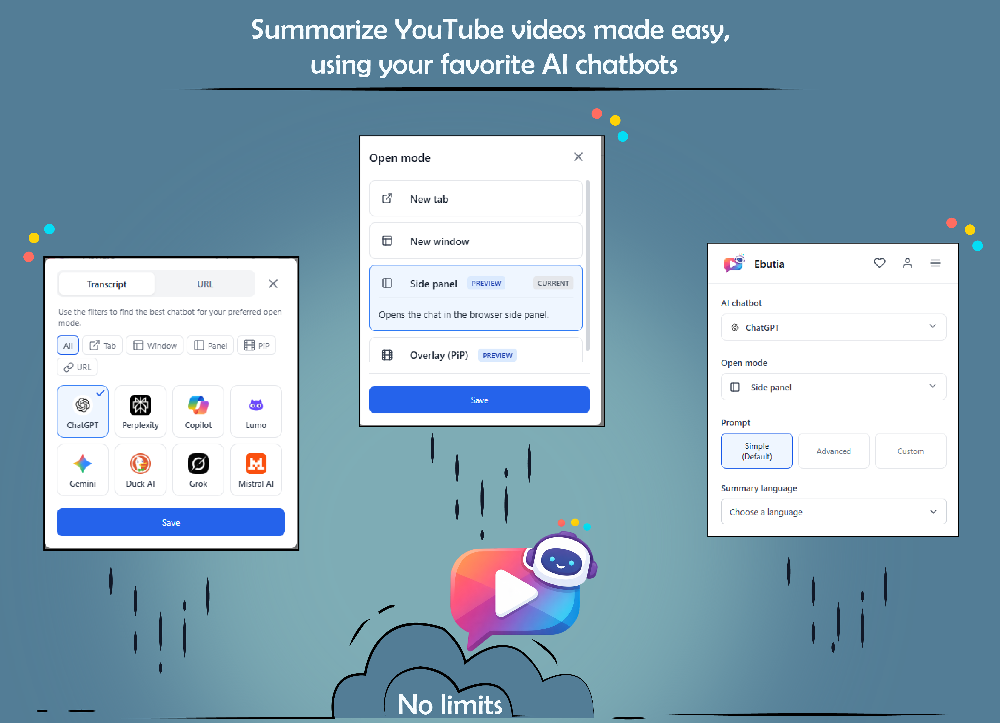

<p align="center">
  
</p>

<h1 align="center">Ebutia</h1>

<p align="center">
  <strong>Summarize YouTubes video, made easy - even without transcripts - using your favorite AI chatbot!</strong>
</p>

<p align="center">
  <a href="#features">Features</a> •
  <a href="#supported-ai-chatbots">AI Chatbots</a> •
  <a href="#screenshots">Screenshots</a> •
  <a href="#development">Development</a>
</p>


Watching YouTube videos can be time-consuming. Ebutia helps you quickly get summaries and ask questions about **any YouTube video** using popular AI chatbots - all without leaving YouTube.

**What makes Ebutia unique:** Unlike other extensions that only work with videos that have transcripts, Ebutia uses intelligent URL-based analysis to summarize **any video** - even those without captions or transcripts. You can even summarize a video **without opening it** - just hover over it on the YouTube homepage or search results and get an instant summary. Ebutia core is open source for transparency.

## Download

<p align="center">
  <a href="https://chromewebstore.google.com/detail/hkddfhfjnkcjmonhgalhnklgldhlhabm"></a>
  <a href="https://addons.mozilla.org/en-US/firefox/addon/Ebutia/"></a>
</p>

## Features

- **Summarize ANY YouTube video** - Works even without transcripts using intelligent URL-based AI analysis
- **No need to open the video** - Summarize directly from the YouTube homepage or search results
- **Ask questions** - Chat with AI about video content
- **Multiple AI chatbots** - Choose from ChatGPT, Perplexity, Lumo, Copilot, and more
- **Multiple open modes** - New tab, popup window, side panel, or picture-in-picture overlay
- **Custom prompts** - Create your own summary prompts
- **No login required** - No account, no sign-up, just install and use
- **No API keys, no limits** - Uses your existing AI chatbot accounts directly, no extra cost
- **Privacy focused** - No tracking, all data stored locally
- **Cross-browser** - Works on Chrome and Firefox

## Supported AI Chatbots

All currently supported chatbots work with **URL-based summarization**, meaning they can analyze and summarize any YouTube video - even those without transcripts!

| Chatbot | URL Summary |
|---------|:-----------:|
| ChatGPT | ✅ |
| Perplexity | ✅ |
| Copilot | ✅ |
| Lumo | ✅ |
| Gemini | ✅ |
| Duck AI | ❌ |
| Grok | ✅ |
| Mistral AI | ❌ |

## Screenshots

<p align="left">
  
</p>

## Browser Compatibility

Ebutia is designed to work seamlessly on both Chrome and Firefox. The build process automatically handles browser-specific requirements:

- **Chrome**: Uses service workers for background scripts (Manifest V3)
- **Firefox**: Uses background scripts with polyfill support (Manifest V3)

Both versions maintain feature parity while adhering to each browser's best practices and security models.

## Security & Privacy

- Uses minimal permissions required for functionality
- All data is stored locally on your device
- No tracking or analytics
- Manifest V3 for better security
- Open source for transparency

### Permissions

- `storage`: Required to store your settings locally
- `activeTab`: Required to access the current YouTube tab
- `contextMenus`: Enables right-click menu options on YouTube
- `sidePanel`: Allows opening AI chat in the browser side panel
- `declarativeNetRequest`: Required for proper communication with AI services
- `host_permissions`: Required to interact with YouTube and AI chatbot websites

## Manual Installation

### Chrome

1. Download the latest release from the [GitHub Releases](https://github.com/user/ebutia/releases) page
2. Unzip the downloaded file
3. Open Chrome and go to `chrome://extensions/`
4. Enable "Developer mode" in the top right
5. Click "Load unpacked" and select the unzipped folder

### Firefox

1. Download the Firefox version (.xpi file) from the [GitHub Releases](https://github.com/user/ebutia/releases) page
2. Open Firefox and go to `about:addons`
3. Click the gear icon and select "Install Add-on From File..."
4. Select the downloaded .xpi file

> **Note**: For development and temporary installation in Firefox, you can use `about:debugging`:
> 1. Go to `about:debugging`
> 2. Click "This Firefox" in the left sidebar
> 3. Click "Load Temporary Add-on"
> 4. Select the `manifest.json` file from the dist folder

## Development

### Prerequisites

- Node.js (v16 or higher)
- npm (v7 or higher)

### Setup

```bash
# 1. Clone the repository
git clone https://github.com/Lanshuns/Ebutia.git
cd ebutia

# 2. Install dependencies
npm install
```

### Development Mode

```bash
# For Chrome
npm run dev

# For Firefox
npm run dev:firefox
```

### Production Build

```bash
# For Chrome
npm run build

# For Firefox
npm run build:firefox
```

The built extension will be available in the `dist_chrome`, `dist_firefox` directories.